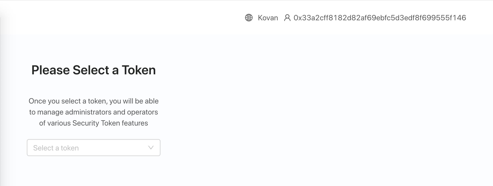

# Purpose

In our series of reference dapp implementations (such as [this](https://github.com/PolymathNetwork/whitelist-standalone) and [this](https://github.com/PolymathNetwork/whitelist-standalone)), we usually conduct a few repetetive bootstrapping steps. Typical steps are:
- Create a new app using `create-react-app`.
- Install dependencies such as `ant-design` and `polymath-sdk`.
- Use React Hooks API to create a simplified Redux data store.
- Initialize Polymath SDK.
- Store relevant properties such as Metamask account address and Network ID.
- Display errors, if any.

By starting a repo from this template, you'd skip all those mundane steps and start solving your business problems right away.

# Create a repo from this template

Just click on `Use this template` button above, then follow the wizard.

# Install & Run

- `git clone [newly-created-repo]`.
- `cd [newly-created-repo-dir]`
- `yarn install && yarn start`

A browser tab should open and present you with a page like this:



# (optional) Deploy to Github pages 

Static web apps such as this one, could be deployed to numerous different hostd, and usually for free. For simplicity, we have preconfigured this repo to be published to Github pages, as we believe it's the most commonly used static website host. But feel free to use any host you prefer.

Before attempting to publish your app, you need to add or modify `homepage` property in `package.json` file. Per create-react-app [deployment guide](https://create-react-app.dev/docs/deployment#step-1-add-homepage-to-packagejson):
, the simplest way is to:
> Open your package.json and add a homepage field for your project:

>  ```"homepage": "https://myusername.github.io/my-app",```

# How it works

See the [wiki](https://github.com/PolymathNetwork/dapp-boilerplate/wiki) section for more information about the structure of this template.

# Obtaining Poly tokens

POLY is an ERC20 utility token. It is required to conduct certain paid operations on Polymath network. For example, reserving a token symbol or attaching additional modules requires a predetermined amount of Poly. Obtaining Poly tokens varies by the Ethereum network in use.
- Kovan: you can obtain Kovan poly, for free, from the deployed [`PolyFaucet` contract](https://github.com/PolymathNetwork/polymath-core/#v200-1). Foruntately, the SDK will obtain Poly on Kovan networks on-the-fly, when it's needed for a certain SDK functionality (eg symbol reservation).
- Mainnet: you can buy Poly tokens on mainnet using one of [these markets](https://coinmarketcap.com/currencies/polymath-network/#markets).
